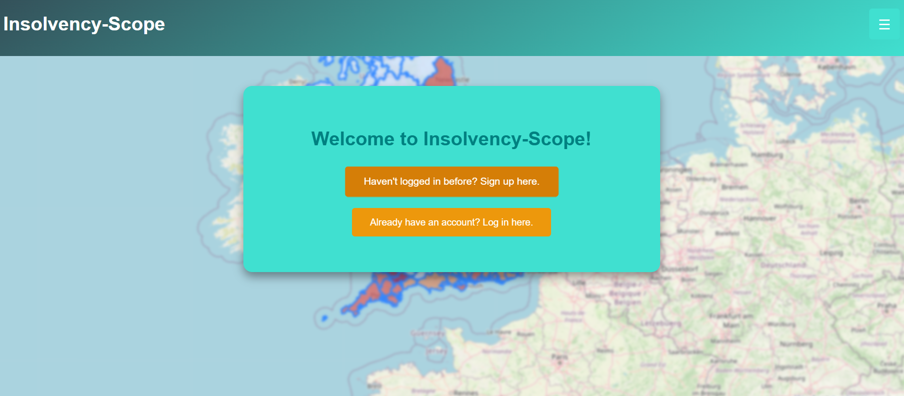

# Insolvency-Scope

**Insolvency-Scope** is a full-stack web application designed to predict and visualize insolvency risks across UK regions. It combines AI-driven forecasting with an interactive choropleth map and route planning to support risk-aware decision making for financial institutions and related stakeholders.



## Features:
- AI-Powered Insolvency Risk Forecasting: Uses an XGBoost model trained on macroeconomic indicators to predict regional insolvency risk scores.
- Interactive Choropleth Map: Built with React and Flask, providing a clear geographic visualization of insolvency risks at a regional level.
- Constraint-Aware Route Planning: Prioritizes travel paths through low-risk zones while minimizing distance, useful for risk-conscious site visits or audits.
- Optimized Backend: Redis caching and spatial queries in MySQL ensure smooth, real-time map rendering and fast API responses.
- Robust Security: OAuth2 authentication for secure API access and TLS with AES-256 encryption protect sensitive data in transit.
  
## Technologies:
- **Backend:** Flask (Python), MySQL, Redis
- **Frontend:** ReactJS
- **Data Processing:** Pandas (Python)

## Installation

### Prerequisites:
- Python 3.8+
- MySQL
- Redis

### Setup:
1. Clone the repository:
   ```bash
   git clone https://github.com/PaulOberg1/insolvency-scope.git
   cd insolvency-scope
2. Install the required Python packages:
   ```bash
   pip install -r requirements.txt
3. Set up environment variables:
   ```bash
   export FLASK_ENV=development
   export SECRET_KEY=your_secret_key
4. Run the application:
   ```bash
   flask run

