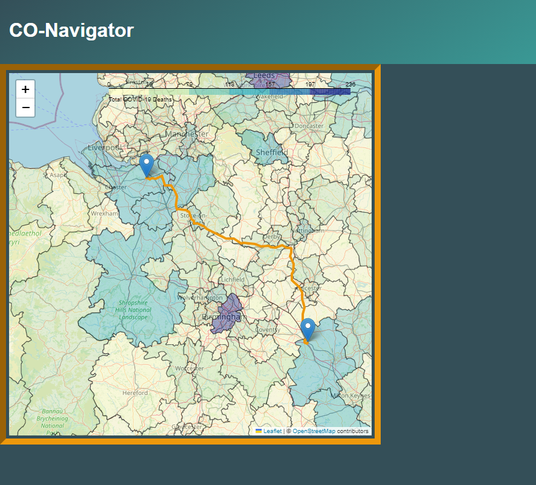

# Co-Navigator

**Co-Navigator** is a full-stack web application that helps users determine optimal COVID-safe travel routes by aggregating real-time COVID-19 data and visualizing it on an interactive map.



## Features:
- Aggregates real-time COVID-19 case data from public APIs.
- Displays an interactive choropleth map with COVID-risk visualizations.
- Provides optimal travel routes based on user input and current case trends.
- Implements secure user authentication and session management with JWT.

## Technologies:
- **Backend:** Flask (Python), MySQL, Redis
- **Frontend:** ReactJS
- **Data Processing:** Pandas (Python)

## Installation

### Prerequisites:
- Python 3.8+
- MySQL
- Redis

### Setup:
1. Clone the repository:
   ```bash
   git clone https://github.com/PaulOberg1/co-navigator.git
   cd co-navigator
2. Install the required Python packages:
   ```bash
   pip install -r requirements.txt
3. Set up environment variables:
   ```bash
   export FLASK_ENV=development
   export SECRET_KEY=your_secret_key
4. Run the application:
   ```bash
   flask run

